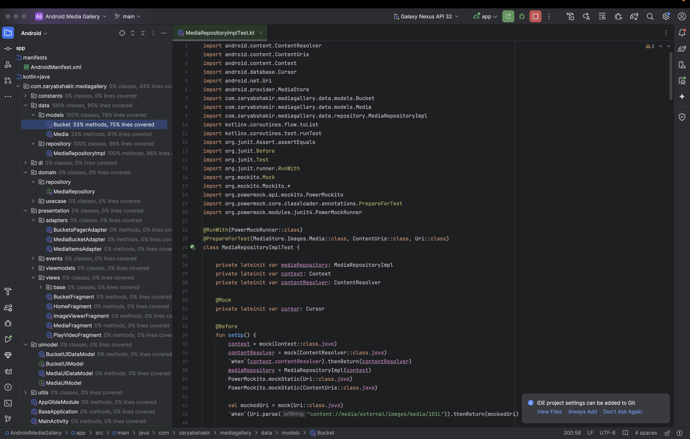
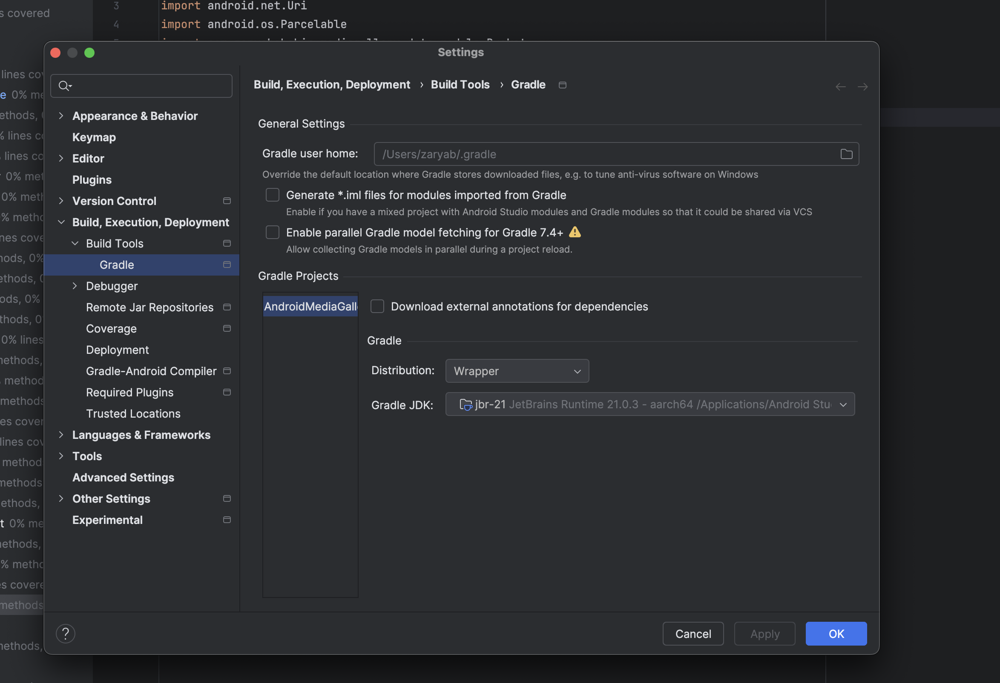

# Android Media Gallery Application

This is a demo project demonstrating an **Android Media Gallery Application** in Android, developed with best practices and following a clean architecture approach. It includes proper permissions handling, efficient data retrieval using MediaStore, and modern Android development libraries.

---

## Features

- **Media Permissions Handling:**
    - Handles permissions based on Android API levels:
        - For API 33 or above: `READ_MEDIA_IMAGES` and `READ_MEDIA_VIDEO`.
        - For below API 33: `READ_EXTERNAL_STORAGE`.
- **Clean Architecture:**
    - **Data Layer:** Media retrieval via MediaStore, data models, and repository implementation.
    - **Domain Layer:** Repository interfaces and use cases.
    - **Presentation Layer:** Views, ViewModels (MVI architecture), and data binding.
- **Modern Android Libraries:**
    - **Dependency Injection:** Hilt
    - **Image Loading:** Glide
    - **Navigation:** Jetpack Navigation (NavGraph)
- **Advanced Features:**
    - MVI architecture with `StateFlow`, `Intents`, and `UIEvents` for unidirectional data flow.
    - Support for **dark and light themes**.
    - Multi-language support: **English** and **Arabic**.
- **Unit Testing:**
    - Repository implementation tested with PowerMockito, achieving 100% coverage.

---

## Project Architecture

This project follows the **Clean Architecture** pattern:

### 1. **Data Layer**
- Retrieves media data using MediaStore queries.
- Implements repository interface defined in the domain layer.
- Contains data models for images and videos.

### 2. **Domain Layer**
- Defines repository interfaces and use cases.
- Ensures a separation of concerns between data handling and business logic.

### 3. **Presentation Layer**
- Contains Views and ViewModels.
- Implements the **MVI (Model-View-Intent)** architecture:
    - Fragments only fire intents.
    - ViewModels emit `UIEvents` using `StateFlow`.
    - Fragments collect and handle `UIEvents`.
    - Utilizes **UIDataModels** for mapping data to UI-friendly structures, ensuring clean separation between business logic and UI rendering.


---

## Libraries and Tools

| Library/Tool      | Purpose                                   |
|--------------------|-------------------------------------------|
| **Hilt**          | Dependency Injection                     |
| **Glide**         | Image Loading                             |
| **NavGraph**      | Navigation between screens               |
| **StateFlow**     | State management for MVI architecture    |
| **DataBinding**   | Binding UI components to data sources    |
| **MediaStore**    | Querying media files from the device      |
| **PowerMockito**  | Unit testing for repository              |

---

## Permissions

This project handles media access permissions for images and videos based on Android API levels:

- **API 33 or above:**
    - `android.permission.READ_MEDIA_IMAGES`
    - `android.permission.READ_MEDIA_VIDEO`
- **Below API 33:**
    - `android.permission.READ_EXTERNAL_STORAGE`

---


## Testing

- **Repository Implementation:**
    - Tested with PowerMockito.
    - Achieved **100% test coverage**.



---

## NOTE
- **Im using jbr21 gradle jdk in my Android Studio**
  

## How to Run the Project

1. Clone the repository:
   ```bash
   git clone <repository-url>
